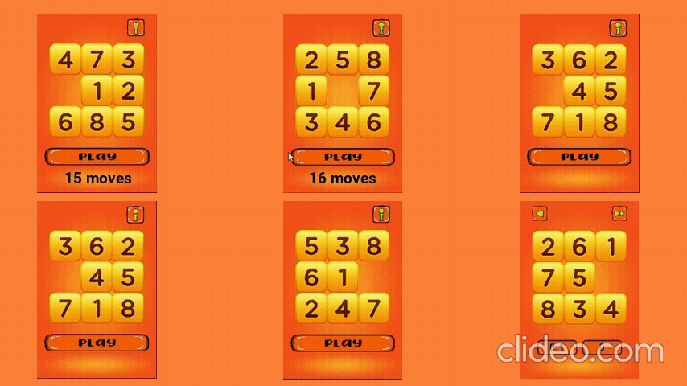

<h1>SOLVING PUZZLE BY SEARCHING</h1>

## Introduction

This project marks the beginning of a series of projects in which simple games will be developed using the pygame library, and these games will be conquered using machine learning algorithms and artificial intelligence in general.

The motivation behind this approach lies in frequent situations where certain evaluation metrics, when applied to specific algorithms, prove to be inaccurate and obscure their true practical significance. In extreme cases, algorithms with poor performance may be inaccurately assessed positively by specific metrics that, in practice, do not reflect their true effectiveness and distort their evaluation.

When developing algorithms to win games, we have two main evaluation metrics that are simple and have empirical significance:

1. Whether the algorithm won or not.
2. If it won, how efficient its performance was.

## Implementing the Puzzle

The puzzle was developed utilizing the numpy library for game logic and the pygame library for the user interface. The game consists of three screens, each serving distinct purposes:

<p align="center"> 
    
</p>

The initial screen dynamically showcases the puzzle through randomized movements, accompanied by a **Play** button. Clicking on this button initiates the game with the current state of the pieces as demonstrated. Additionally, an **i** button directs users to the game's github repository for further exploration.

<p align="center"> 
    
</p>

Upon game commencement, the interface displays a timer and tracks movements made by the user. It allows users to return to the home screen, interact with the puzzle, and request automatic resolution via AI.

<p align="center"> 
    
</p>

When the game is successfully completed, the timer and movement tracking pause. Interaction with the puzzle and automatic solving functionalities are disabled, while the option to return to the home screen remains available. Additionally, users can opt to restart the game from this screen.

## Search Strategies

The `notebooks` folder contains all the notebooks where the search algorithm experiments were conducted. Initially, two uninformed search algorithms were implemented, namely, breadth-first search and depth-first search with backtracking. Both achieved consistent and correct results, however, their behavior began to degrade when faced with puzzle instances that required more steps to be solved, achieving good results in situations that required up to 23 steps on average.

Considering that instances of this problem typically require 22 to 28 steps on average to be solved and can reach a maximum of 31 steps, the results obtained with the previous algorithms were insufficient. Therefore, it was necessary to implement two informed search algorithms, namely, the A* algorithm in both graph and tree modes.

Both the A* algorithms proved to be more efficient than the uninformed options, with the tree-based search standing out due to the reduction in bottleneck in maintaining information of visited nodes and their subsequent verification, managing to achieve a processing time of 5 seconds for one of the two worst instances with 31 steps for resolution, as follows:

<p align="center"> 
    
</p>

<p align="center"> 
    
</p>

Adopting the A* tree-based search strategy for puzzle resolution, we obtained the following results for 6 different instances:

<p align="center"> 
    
</p>

In the end, we have the following result for the complete game:

<p align="center"> 
    
</p>

## Puzzle Pack Organization
```
puzzle/                         Top-level package
      __init__.py
      constants.py
      logic_game.py
      puzzle.py                 It brings together the functionalities of the modules to implement the puzzle
      media/                    Folder with the .png files used in the game's interface
              ...
      formulations/             Can be extended with different puzzle settings
              __init__.py
              constants.py
              standard_form.py  Sets the default formulation of the puzzle problem
      search_algorithm/         Implementation of the A* tree search algorithm         
              __init__.py
              asts.py
              constants.py
              node.py
              priority_queue.py Sets the priority queue
```
## Running the Game

Using some Linux distro and make sure you have [Python 3](https://www.python.org/) installed.

Clone the project:

```bash
  git clone https://github.com/filipemedeiross/solving_puzzle_by_searching.git
```

Access the project directory:

```bash
  cd solving_puzzle_by_searching
```

Creating a virtual environment (for the example we use the location directory parameter as `.venv`):

```bash
  python3 -m venv .venv
```

Activating the virtual environment:

```bash
  source .venv/bin/activate
```

Install all required packages specified in requirements.txt:

```bash
  pip install -r requirements.txt
```

Use the following command to run the game:

```bash
  python3 main.py
```
## References

Stuart Russell and Peter Norvig. **Artificial Intelligence: A Modern Approach**. 3rd ed., Pearson, 2009.

Numpy: <https://numpy.org/doc/stable/>

Pygame: <https://www.pygame.org/docs/>

Images used: <https://opengameart.org/>
